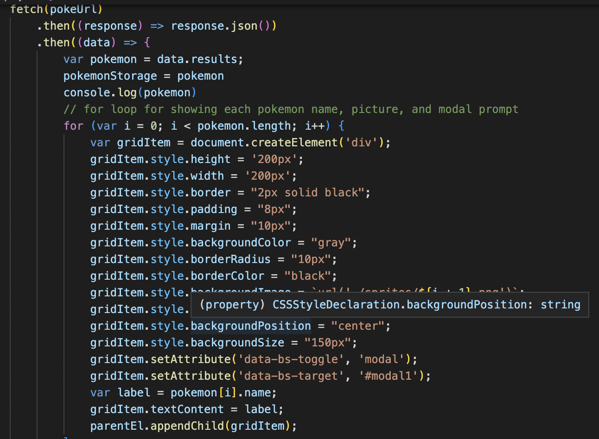
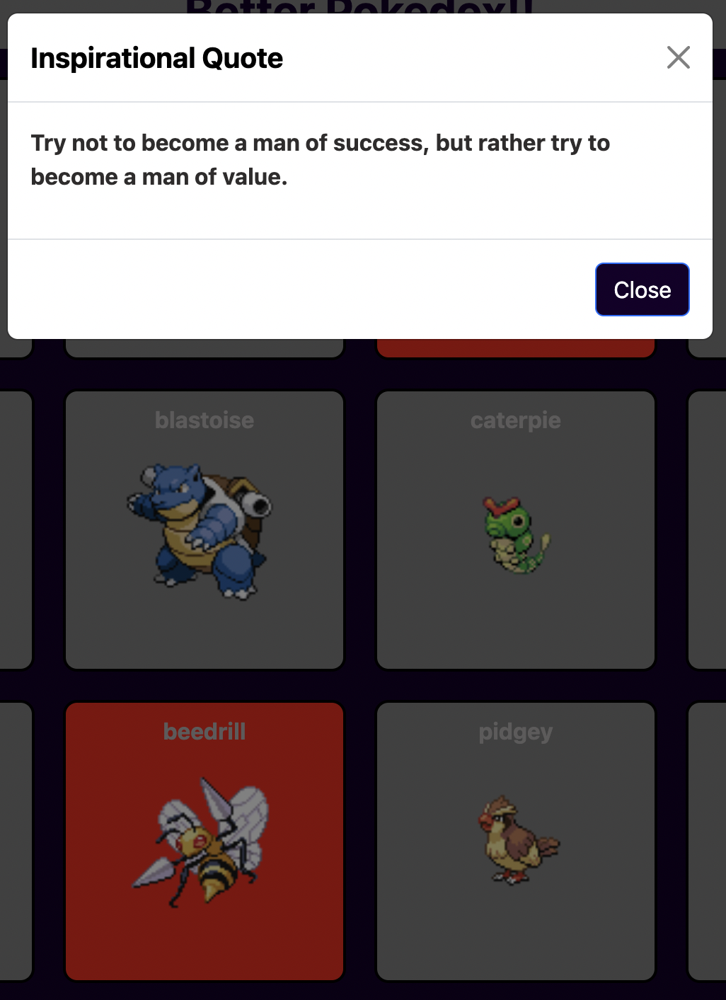

# Better PokeDex

## Table of Contents
1. [Description](#description)
2. [Visuals](#visuals)
3. [Future Development](#future-development)

## Description

We created a website that allows Pokemon players to track which of the original 151 pokemon they have caught. Along with that, it also gives inspirational quotes to keep them motivated to catch them all. 

This project was heavily JavaScript based using two apis for pokemon names and sprites, and quotes. We used event listeners and local storage so that users can keep track of who they have caught without losing progress upon page refresh.

We used bootstrap in order to create modals that would appear upon clicking a pokemon they have caught and to style the HTML along with using CSS and JavaScript to design each box that each pokemon is in.

## Visuals

This photo shows the fetch url where we used the API to capture the pokemon names and created all the styling for the boxes, along with modal prompts and appending.

This is what pops up on screen after clicking on a box that contains a Pokemon. The background changes to red to signify having caught it, and the quote pops up in a modal to inspire users to keep their motivation and catch more Pokemon.

## Future Development
For future development, we'd like to include pokemon stats on the modal, to provide users with more information when they do catch the pokemon.